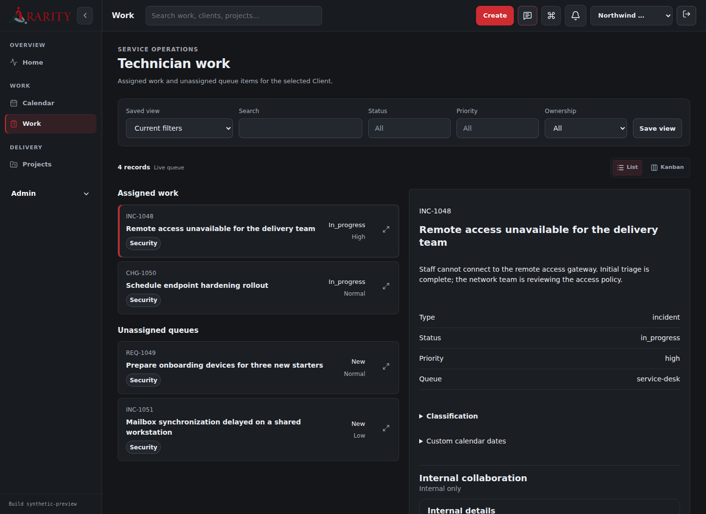
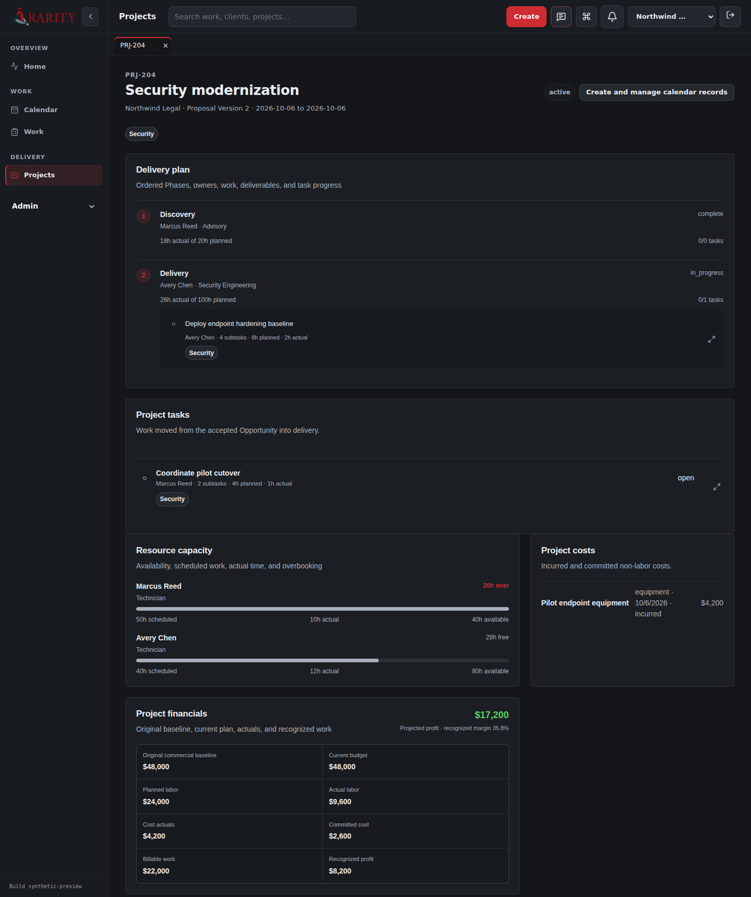
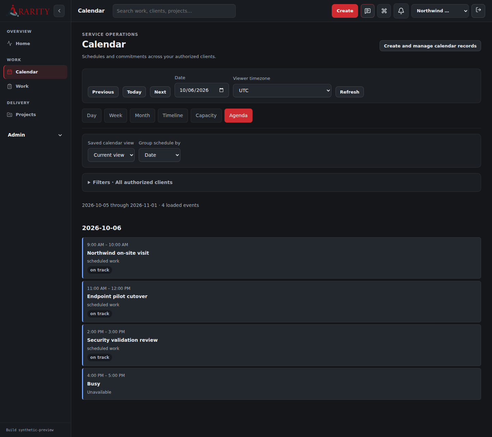
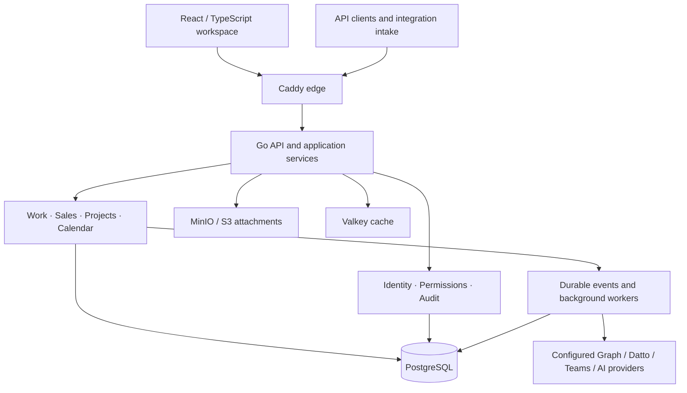

<div align="center">

# Rarity Ticket Intelligence

**A self-hosted operations platform for managed service providers.**

Tickets, sales, project delivery, and scheduling in one Go and React application.


[Try the UI](#try-the-ui-without-credentials) · [Architecture](#architecture) · [Development](#development) · [Documentation](docs/README.md)

</div>

Rarity serves **one MSP per installation and many logically isolated client organizations**. Technicians can triage work, track time, and collaborate; sales teams can progress opportunities and versioned proposals; delivery teams can manage projects, commercial baselines, and resource commitments. A shared calendar brings those commitments together without copying the source records into a separate scheduling product.

**Status:** Core workflows and the unified calendar are implemented. Local qualification and constrained authenticated demo acceptance are recorded in the [current execution backlog](docs/09-roadmap/current-execution.md). Provider, supported deployment, capacity, and manual accessibility qualification remain release gates.



*The actual React application, rendered with synthetic Northwind data through the read-only documentation preview. No customer data or live provider accounts are shown.*

| Project delivery | Unified calendar |
| --- | --- |
| [](docs/screenshots/project-delivery.png) | [](docs/screenshots/calendar.png) |
| Ordered phases, resource capacity, costs, and commercial baselines. | Day, Week, Month, Timeline, Capacity, and Agenda lenses with timezone-aware source navigation. |

[Screenshot provenance and reproduction](docs/screenshots/README.md)

## What is implemented

| Area | Concrete behavior |
| --- | --- |
| Technician operations | Client-scoped worklists, filtering and pagination, List/Kanban views, ticket timers, time entries, attachments, workflow transitions, and internal collaboration. |
| Sales and delivery | Opportunities and pipelines, versioned proposals, conversion previews, project phases and tasks, costs, resource plans, and change-order approval/application. |
| Calendar | Authorized filters, saved lenses, dependencies, scheduling previews with explicit confirmation, capacity, typed administration, and source date editors. Private commitments render as Busy. |
| Platform | Application access and Entra/local administrator flows, role and capability checks, audit records, durable events, classification, mentions, and notifications. |
| Integrations and AI | Graph/Teams, Datto, webhook, automation, and governed AI workflows have source implementations. Configured-provider acceptance is tracked separately. |

The client portal is future work. The current application is technician-first; feature implementation does not imply that every provider or deployment profile has completed acceptance.

## Try the UI without credentials

Requires **Node.js 22.12 or newer** and npm. From the repository root:

```bash
git clone https://github.com/AaronCampbellit/rarity-ticket-intelligence-public.git
cd rarity-ticket-intelligence-public
npm --prefix frontend ci
node docs/screenshots/preview.mjs
```

Open **http://127.0.0.1:41732/#/work**, then use **Projects** and **Calendar** in the sidebar. Select a ticket, switch between List and Kanban, open the project, and explore the calendar lenses. Press `Ctrl+C` to stop the preview.

This starts Vite and a synthetic HTTP fixture on loopback. It requires no Go server, database, login credentials, API keys, or provider connections. It supports the illustrated read journeys; edits, timers, scheduling mutations, and unimplemented preview routes return an explicit error. It demonstrates the rendered application rather than backend authorization, persistence, or integration behavior. Alternate ports and capture steps are in the [preview guide](docs/screenshots/README.md).

For the real application, follow [local development and first ticket](docs/06-development/local-development.md). Its Compose workflow generates local credentials, applies migrations, and uses the normal setup and sign-in process. Use a disposable environment and synthetic clients.

## Architecture



The browser uses supported application APIs. Domain mutations pass through application services so validation, client scope, permissions, history, and events share one boundary. The API process composes the background workers into one deployable runtime with clear domain boundaries.

| Engineering decision | Purpose and source |
| --- | --- |
| Explicit client context | Preserve client isolation through browser/API requests and repository operations. See [organizations](docs/02-platform/organizations.md) and [isolation integration tests](tests/integration/project_isolation_test.go). |
| Preview before consequential changes | Show conversion and scheduling effects before application, with version checks and explicit confirmation. See [project API](frontend/src/features/projects/api.ts) and [calendar workspace](frontend/src/features/calendar/CalendarPage.tsx). |
| Durable background work | Retain events and run integration, automation, notification, classification, and calendar workers outside interactive request paths. See [runtime composition](backend/cmd/rarity-api/main.go). |
| Shared design system and lazy features | Keep workspace behavior consistent while loading major protected pages on demand. See [design system](docs/07-ui-ux/design-system.md) and [application routes](frontend/src/App.tsx). |
| Revision-bound release evidence | Reject promotion when required evidence is absent, stale, or belongs to another candidate. See [release-readiness gate](docs/06-development/release-readiness.md). |

## Development

Go versions and the toolchain are declared in [go.mod](go.mod). Frontend versions and scripts live in [frontend/package.json](frontend/package.json).

```bash
go test ./backend/... ./tests/...
npm --prefix frontend ci
npm --prefix frontend test
npm --prefix frontend run build
node scripts/validate-markdown-links.mjs
node scripts/validate-docs.mjs
```

Database-dependent tests skip without `TEST_DATABASE_URL`; a portable pass is not PostgreSQL acceptance. The [development guide](docs/06-development/local-development.md) covers disposable PostgreSQL, real-service browser journeys, Compose setup, and first-ticket configuration. [CI](.github/workflows/ci.yml) includes source, security/dependency, database, browser, and infrastructure gates.

This public copy runs CI without publishing container releases. The image-publishing workflow is restricted to the original repository identity; retained release records describe private historical artifacts.

```text
backend/         Go API, domain services, commands, migrations, and tests
frontend/        React workspaces and shared design system
infrastructure/  Compose, HA, backups, observability, and release contracts
tests/           Cross-client and PostgreSQL integration acceptance
docs/            Architecture, development, decisions, and release evidence
docs-site/       Local architecture and progress tracker
```

On macOS, `./launch-docs.command` opens the fully local architecture tracker. Its static entry point is [docs-site/index.html](docs-site/index.html).

## Release boundaries

The [current execution backlog](docs/09-roadmap/current-execution.md) supersedes older calendar plans and checkbox states. The calendar workspace is implemented; remaining acceptance includes configured providers, supported Ubuntu pilot/HA environments, restore/DR, upgrades, telemetry, capacity, manual accessibility, and a release-owner decision for one immutable candidate. Historical demo and signed-artifact evidence certify only their recorded revisions and environments.

A readable demo and passing source checks do not replace those gates. Do not connect the documentation preview to a live database or expose it as an authenticated application.

## License, branding, and ownership

Aaron Campbell reserves all rights to the original material he owns; see [LICENSE](LICENSE). Third-party code, dependencies, and assets retain their own licenses and notices. See [third-party notices](THIRD_PARTY_NOTICES.md) for reviewed components and outstanding publication or distribution requirements.

The **Rarity** name and associated branding are owned by **Rarity LLC**. The original software is owned by **Aaron Campbell**. This repository grants no rights to Rarity LLC's name, logos, or branding. See [the ownership and branding notice](BRANDING.md).
